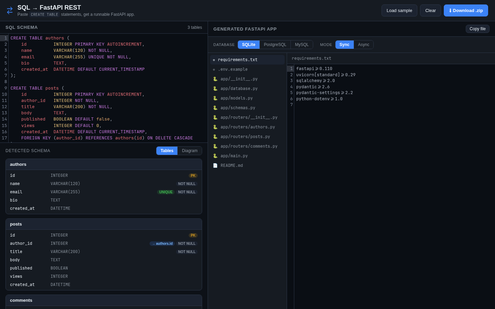
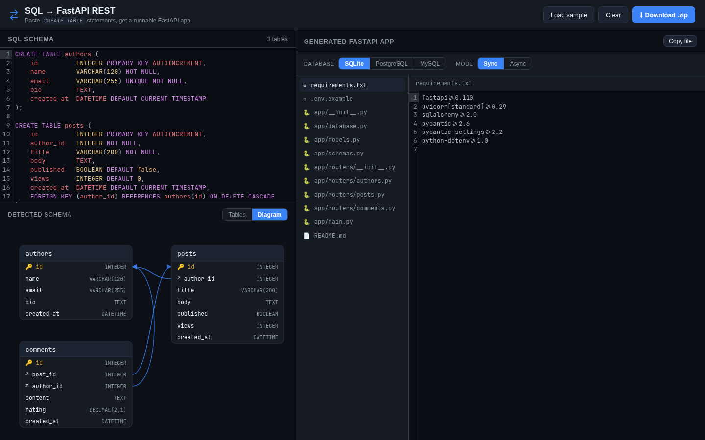

# sql-to-rest

A React app that turns SQL `CREATE TABLE` statements into a runnable **Python
FastAPI** REST application. Paste your schema (tables, columns, primary keys and
foreign-key relationships) and get back SQLAlchemy models, Pydantic schemas, and
per-table CRUD routers — downloadable as a `.zip`.

**🔗 Live demo: https://joeyvigil.github.io/sql-to-rest/**



## Features

- Pragmatic `CREATE TABLE` parser (MySQL / PostgreSQL / SQLite dialects)
- Detects primary keys, `NOT NULL`, `UNIQUE`, defaults, `AUTO_INCREMENT`/`SERIAL`
- Inline and table-level `FOREIGN KEY ... REFERENCES` → SQLAlchemy relationships
- **Generation options** — target SQLite / PostgreSQL / MySQL, and choose
  **sync or async** SQLAlchemy (the right driver, engine, session, and route
  handlers are emitted for each combination)
- **ER diagram** view that visualizes the parsed tables and their relationships
- **Syntax highlighting** — a CodeMirror SQL editor for input and highlighted
  Python output
- Generates a complete FastAPI project:
  - `app/database.py`, `app/models.py`, `app/schemas.py`
  - one CRUD router per table (`list / get / create / update / delete`)
  - `app/main.py`, `requirements.txt`, `.env.example`, `README.md`
- Live preview with file tree, copy-to-clipboard, and zip download

### ER diagram



## Develop

```bash
npm install
npm run dev
```

Open the printed local URL.

## Build

```bash
npm run build
npm run preview
```

## How it works

`src/lib/sqlParser.ts` parses the SQL into a small schema model
(`src/types.ts`). `src/lib/generator.ts` walks that model and emits the FastAPI
source files, which the UI renders and zips up via JSZip.
